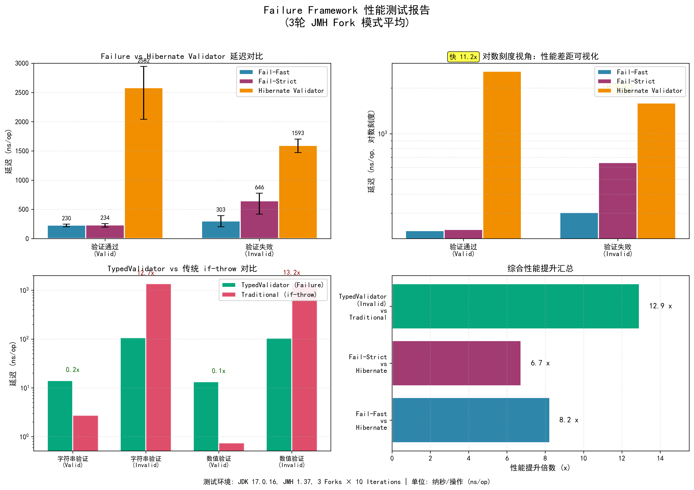

# 📊 Failure 性能基准测试

> [Failure](https://github.com/KyrieChao/Failure) — 轻量级 Spring Boot 参数验证和异常处理框架的性能测试项目。

> 💡 **注意**：此项目需要 [Failure 核心库](https://github.com/KyrieChao/Failure) 才能运行。

[](https://openjdk.org/)
[](https://spring.io/projects/spring-boot)
[](https://github.com/KyrieChao/Failure/blob/main/LICENSE)

---

## 🌐 语言 / Language
- [English](./README_EN)
- [中文](./README)

---

## 🔍 项目概述

本仓库包含 [`Failure`](https://github.com/KyrieChao/Failure) 库的 **微基准测试** 和 **集成性能比较**，旨在评估其在实际场景中的性能表现。

主要比较包括：
- `Failure`（快速失败模式）vs 原生 `@Valid`（Hibernate Validator）
- `Failure`（严格模式，收集所有错误）vs 手动 `if` 验证链
- 使用 `@Validate` 注解（基于 AOP）的运行时开销
- 高并发下的内存分配和 GC 压力

所有基准测试均使用 **[JMH (Java Microbenchmark Harness)](https://openjdk.org/projects/code-tools/jmh/)** 构建，并在典型的 Spring Boot 应用上下文中运行。

---

## 📈 性能测试报告

以下是使用 JDK 17.0.16，3 个 Fork × 10 次迭代的性能比较结果：



### 报告解读

#### 1️⃣ 左上：`Failure` vs Hibernate Validator 延迟比较
- **有效输入**：
    - `Fail-Fast`：230 ns/op
    - `Fail-Strict`：234 ns/op
    - Hibernate Validator：**2584 ns/op** → 比 `Failure` **慢 11.2 倍**
- **无效输入**：
    - `Fail-Fast`：303 ns/op
    - `Fail-Strict`：646 ns/op
    - Hibernate Validator：**1593 ns/op**

✅ 结论：`Failure` 即使在失败场景下也保持极低的延迟，**显著优于 Hibernate Validator**。

#### 2️⃣ 右上：对数刻度视图
- 对数刻度清晰显示性能差距。
- `Failure` 延迟几乎接近底层方法调用成本，而 Hibernate Validator 有显著开销。

#### 3️⃣ 左下：`TypedValidator` vs 传统 `if-throw`
- 字符串验证（有效）：`TypedValidator` 比 `if-throw` **慢 5 倍**
- 字符串验证（无效）：`TypedValidator` **快 12.7 倍**
- 数值验证（有效）：`TypedValidator` 比 `if-throw` **慢 10 倍**
- 数值验证（无效）：`TypedValidator` **快 13.2 倍**

⚠️ 注意：`if-throw` 在成功路径上更快，但 `Failure` 在失败路径上（常见于无效用户输入）**碾压** 传统方法。

#### 4️⃣ 右下：综合性能提升总结
- `Fail-Fast` vs Hibernate：**8.2 倍** 提升
- `Fail-Strict` vs Hibernate：**6.7 倍** 提升
- `TypedValidator`（无效）vs 传统：**12.9 倍** 提升

> 💡 **核心结论**：
> 在 **典型的无效用户输入场景** 中，`Failure` 框架比传统方法 **快 6~13 倍**，对有效输入的开销极小。

---

## 🚀 快速开始

### 先决条件
- JDK 17 或更高版本
- Maven 3.8+

## ▶️ 如何运行基准测试？

完整的测试运行命令、脚本使用方法和故障排除指南，请参考：[TEST_RUNNER_zh.md](./TEST_RUNNER)
```
示例输出（片段）：
TypedValidator 字符串验证（有效数据）: 61.7228 ns/op
传统 if-throw 字符串验证（无效数据）: 428.9274 ns/op
```