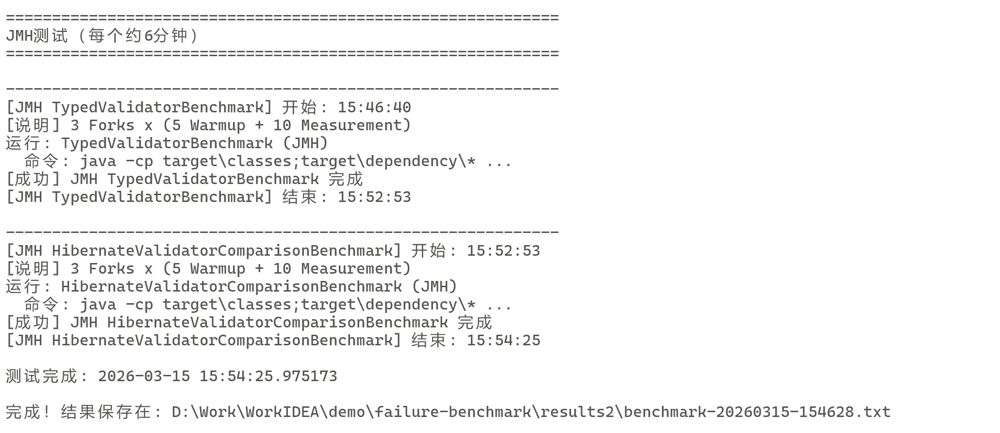
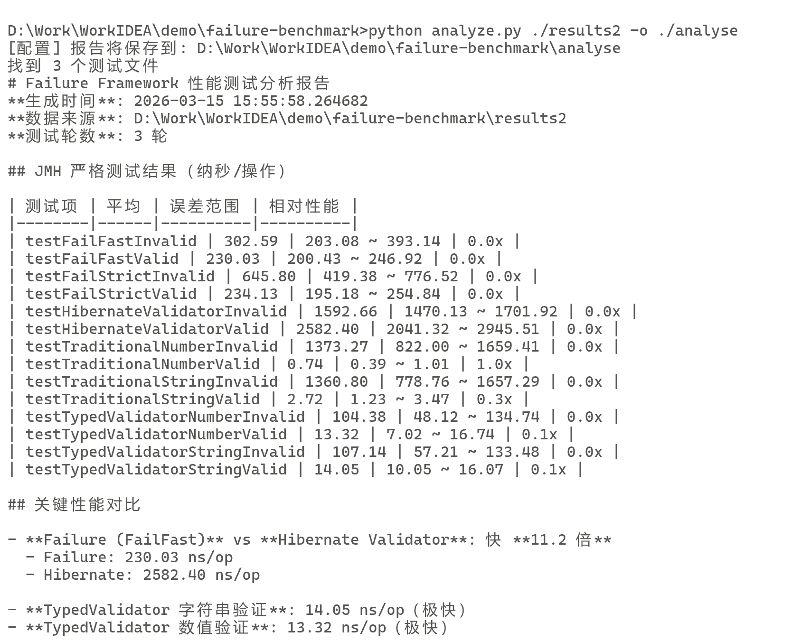
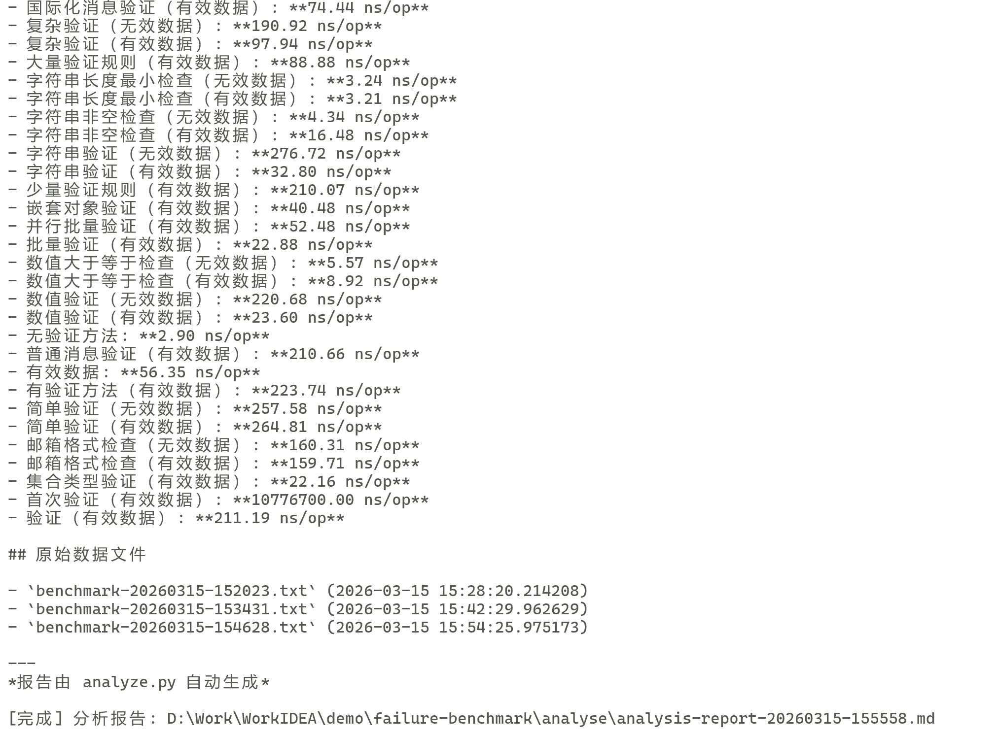

# Test Runner Guide

## 🌐 Language / 语言
- [English](./TEST_RUNNER_EN.md)
- [中文](TEST_RUNNER.md)

This guide provides run commands for all test classes in package `com.chao.benchmark` (`src/main/java/com/chao/benchmark/`).

## Compile the Project

Before running any tests, ensure the project is compiled:

```bash
mvn clean compile
```

```bash
mvn dependency:copy-dependencies -DoutputDirectory=target/dependency 
```

## Test Class Run Commands

### Manual Test Classes

| Test Class | Run Command | Description |
|------------|-------------|-------------|
| `NoSpringChainBenchmark` | `java -cp "target\classes;target\dependency\*" com.chao.benchmark.NoSpringChainBenchmark` | Validation chain performance test without Spring dependencies |
| `NoSpringTypedValidatorBenchmark` | `java -cp "target\classes;target\dependency\*" com.chao.benchmark.NoSpringTypedValidatorBenchmark` | TypedValidator performance test without Spring dependencies |
| `ManualTypedValidatorBenchmark` | `java -cp "target\classes;target\dependency\*" com.chao.benchmark.ManualTypedValidatorBenchmark` | Manual TypedValidator performance test (to verify fix effectiveness) |
| `AopValidationBenchmark` | `java -cp "target\classes;target\dependency\*" com.chao.benchmark.AopValidationBenchmark` | AOP validation performance test |
| `BatchValidationBenchmark` | `java -cp "target\classes;target\dependency\*" com.chao.benchmark.BatchValidationBenchmark` | Batch validation performance test |
| `ChainValidationBenchmark` | `java -cp "target\classes;target\dependency\*" com.chao.benchmark.ChainValidationBenchmark` | Validation chain performance test |
| `ComplexObjectValidationBenchmark` | `java -cp "target\classes;target\dependency\*" com.chao.benchmark.ComplexObjectValidationBenchmark` | Complex object validation performance test |
| `ConcurrentValidationBenchmark` | `java -cp "target\classes;target\dependency\*" com.chao.benchmark.ConcurrentValidationBenchmark` | Concurrent validation performance test |
| `CoreValidationBenchmark` | `java -cp "target\classes;target\dependency\*" com.chao.benchmark.CoreValidationBenchmark` | Core validation chain performance test |
| `I18nValidationBenchmark` | `java -cp "target\classes;target\dependency\*" com.chao.benchmark.I18nValidationBenchmark` | Internationalization validation performance test |
| `ReflectionCacheBenchmark` | `java -cp "target\classes;target\dependency\*" com.chao.benchmark.ReflectionCacheBenchmark` | Reflection cache performance test |
| `SimpleValidationBenchmark` | `java -cp "target\classes;target\dependency\*" com.chao.benchmark.SimpleValidationBenchmark` | Simple validation performance test |
| `SpringIntegrationBenchmark` | `java -cp "target\classes;target\dependency\*" com.chao.benchmark.SpringIntegrationBenchmark` | Spring integration performance test |
| `ValidationBenchmark` | `java -cp "target\classes;target\dependency\*" com.chao.benchmark.ValidationBenchmark` | Core validation performance test |
| `ValidationChecksBenchmark` | `java -cp "target\classes;target\dependency\*" com.chao.benchmark.ValidationChecksBenchmark` | Validation checks performance test |
| `ValidationRulesCombinationBenchmark` | `java -cp "target\classes;target\dependency\*" com.chao.benchmark.ValidationRulesCombinationBenchmark` | Validation rules combination performance test |
| `TypedValidatorBenchmark` | `java -cp "target\classes;target\dependency\*" com.chao.benchmark.TypedValidatorBenchmark` | TypedValidator performance test |
| `HibernateValidatorComparisonBenchmark` | `java -cp "target\classes;target\dependency\*" com.chao.benchmark.HibernateValidatorComparisonBenchmark` | Hibernate Validator comparison test |


Or<br/>
### Run with [run_benchmarks](../run_benchmarks.py) script


### Script analysis [analyze](../analyze.py) 



**run_benchmarks.py parameters**

| Parameter | Short | Description | Default |
|-----------|-------|-------------|---------|
| `--output-dir` | `-o` | Specify directory to save test result files | Current directory |
| `--manual-only` | - | Run only manual tests (main entry) | off |
| `--jmh-only` | - | Run only JMH (requires benchmarks or includes) | off |
| `--manual-tests` | - | Manual test class list (comma-separated) | all |
| `--jmh-includes` | - | Include list passed to org.openjdk.jmh.Main (comma-separated) | unset |
| `--jmh-golden` | - | Run golden JMH suite (`com.chao.benchmark.jmh.*`) | off |
| `--jmh-args` | - | Extra JMH args (e.g. `-wi 5 -i 10 -f 3 -prof gc`) | unset |

**Examples:**

```bash
# Output to current directory by default
python run_benchmarks.py

# Specify output directory (created automatically)
python run_benchmarks.py -o ./benchmark-results
python run_benchmarks.py --output-dir D:/Work/failure-benchmark/results

# Run golden suite (JMH), and write raw JSON into the output directory
python run_benchmarks.py -o ./benchmark-results --jmh-only --jmh-golden

# Quick sanity check (short JMH run, for pipeline validation only)
python run_benchmarks.py -o ./benchmark-results --jmh-only --jmh-golden --jmh-args "-f 1 -wi 1 -i 1 -r 200ms -w 200ms"
```

### JMH args cheat sheet (used in --jmh-args)

| Arg | Meaning | Effect |
|-----|---------|--------|
| `-f N` | Fork count (separate JVM processes) | Cleaner repetition, higher confidence, slower |
| `-wi N` | Warmup iterations | More warmup, less JIT/cold noise |
| `-w T` | Warmup time per iteration | Longer warmup window, less noise |
| `-i N` | Measurement iterations | More stable statistics, better for comparison |
| `-r T` | Measurement time per iteration | Longer measurement window, less noise |

### Recommended presets

```bash
# 1) Very fast pipeline sanity (seconds~minutes): verify JMH/JSON/script chain only
python run_benchmarks.py -o ./benchmark-results --jmh-only --jmh-includes com.chao.benchmark.jmh.ChecksGoldenBenchmark.* --jmh-args "-f 1 -wi 1 -i 1 -r 200ms -w 200ms"

# 2) Fast trend check (minutes): core comparison, good for local/CI
python run_benchmarks.py -o ./benchmark-results --jmh-only --jmh-includes com.chao.benchmark.jmh.ValidationGoldenBenchmark.* --jmh-args "-f 1 -wi 3 -i 5 -r 1s -w 1s"

# 3) Report-grade (slower): core comparison + multiple forks
python run_benchmarks.py -o ./benchmark-results --jmh-only --jmh-includes com.chao.benchmark.jmh.ValidationGoldenBenchmark.* --jmh-args "-f 3 -wi 5 -i 10 -r 1s -w 1s"
```

**analyze.py parameters**

| Parameter | Short | Description | Default |
|-----------|-------|-------------|---------|
| `input_dir` | Positional | Directory containing `benchmark-*.txt` files | `.` (current directory) |
| `--output-dir` | `-o` | Analysis report save directory | Current directory |

**Examples:**
```bash
# Analyze test files in current directory, output report to current directory
python analyze.py

# Analyze specified directory, output report to current directory
python analyze.py ./benchmark-results

# Specify input and output directories (completely separated)
python analyze.py ./benchmark-results -o ./analysis-reports
python analyze.py D:/Work/failure-benchmark/results --output-dir D:/Work/failure-benchmark/analysis

# Using absolute paths
python analyze.py "D:\Work\failure-benchmark\results" -o "D:\Work\failure-benchmark\analysis"
```


### Recommended Combined Usage Flow
```bash
# 1. First create dedicated directories
mkdir benchmark-results
mkdir analysis-reports

# 2. Run tests, save results to benchmark-results
python run_benchmarks.py -o benchmark-results

# 3. Analyze results, save reports to analysis-reports  
python analyze.py benchmark-results -o analysis-reports
```

## Running Notes

1. **Dependency Issues**:
   - Some test classes may depend on Spring-related libraries and may encounter `ClassNotFoundException` when running
   - Test classes without Spring dependencies (like the `NoSpring*` series) should run normally

2. **Performance Test Environment**:
   - When running performance tests, it's recommended to close other programs that consume system resources
   - Run tests multiple times to get more stable results
   - Test results may vary in different environments

3. **Test Result Interpretation**:
   - `ns/op`: Nanoseconds per operation, smaller values indicate better performance
   - `Valid data`: Scenarios where validation passes
   - `Invalid data`: Scenarios where validation fails
   - `Fail-Fast`: Fast failure mode, stops immediately once an error is found
   - `Fail-Strict`: Strict mode, collects all errors before stopping

4. **JMH Test Special Notes**:
   - By default, this repo does not force running JMH (if no JMH benchmarks exist, it will skip)
   - To run JMH, pass include patterns via `--jmh-includes` (e.g. `com.chao.benchmark.jmh.*`)

## Troubleshooting

If you encounter `ClassNotFoundException` or other dependency issues, you can try:

1. Ensure the project is correctly compiled: `mvn clean compile`
2. Check if Maven dependencies are complete: `mvn dependency:tree`
3. For Spring-related tests, ensure Spring dependencies are correctly added
4. For JMH tests, ensure JMH dependencies are correctly added

If you encounter `Unable to acquire the JMH lock (.../jmh.lock)`:
- Make sure no other JMH process is running (a previous run may still hold the lock)
- If no process is running, delete the lock file: `%TEMP%\\jmh.lock` (Windows)

## Sample Output

### Manual Test Class Output Example:

```
Starting TypedValidator performance test without Spring dependencies...
Test count: 1000000
=======================================
TypedValidator string validation (valid data): 61.7228 ns/op
TypedValidator numeric validation (valid data): 38.8777 ns/op
Traditional if-throw string validation (valid data): 6.9409 ns/op
Traditional if-throw string validation (invalid data): 428.9274 ns/op
Traditional if-throw numeric validation (valid data): 2.4891 ns/op
Traditional if-throw numeric validation (invalid data): 461.6256 ns/op
=======================================
TypedValidator performance test without Spring dependencies completed!
```


## Summary

This guide provides run commands for all test classes in package com.chao.benchmark, helping you quickly execute performance tests and verify effectiveness. If you encounter any issues, please refer to the troubleshooting section or contact the project maintainers.
